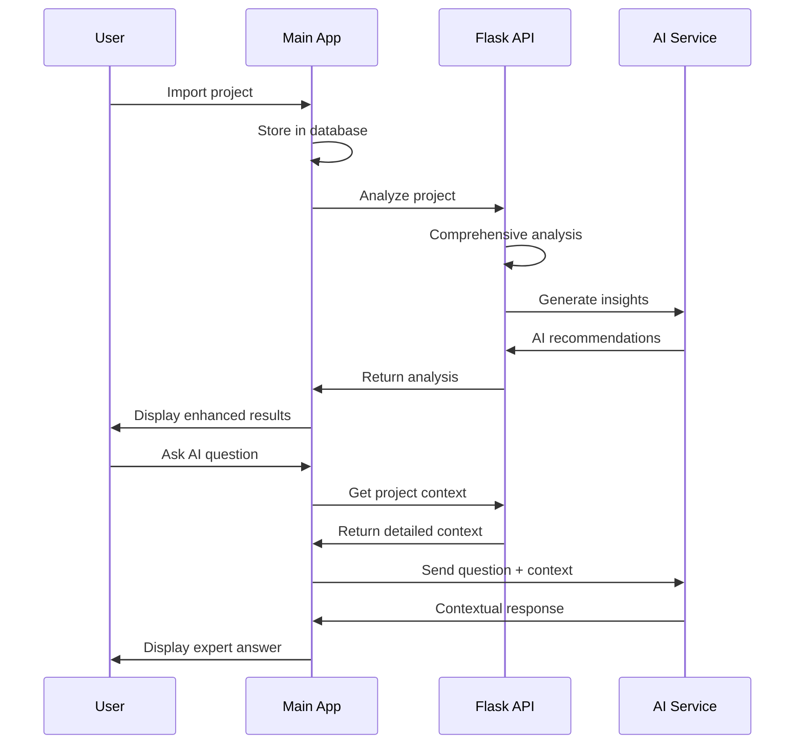

# LeviatanCode Complete Workflow Process

## System Architecture Overview

```
User Interface (Browser)
        ↓
LeviatanCode Main App (Port 5000)
├── React Frontend (File Explorer, AI Chat, Editor)
├── Express Backend (Project Management, Sessions)
├── PostgreSQL Database (Projects, Files, Chat History)
└── Flask Analyzer API (Port 5001)
    ├── Advanced Project Analysis
    ├── AI-Powered Insights
    └── Comprehensive Reporting
```

## Complete User Workflow

### 1. Project Import & Initial Setup
```
User Action: Import Project
    ↓
Main App: Receives ZIP file or Git URL
    ↓
Main App: Creates project entry in database
    ↓
Flask Analyzer: Runs comprehensive analysis
    ↓
Main App: Displays enhanced project insights
```

**What happens:**
- User uploads ZIP file or provides Git repository URL
- Main LeviatanCode app processes the import and stores files
- Automatically triggers Flask analyzer for deep analysis
- Results combined and displayed in the UI with enhanced insights

### 2. Project Analysis & AI Insights
```
User Action: Views project or requests analysis
    ↓
Main App: Loads basic project info from database
    ↓
Flask Analyzer: Provides comprehensive analysis
    - Technology detection (15+ languages)
    - Framework identification (20+ frameworks)
    - Build system analysis (10+ systems)
    - Code quality scoring
    - AI-powered recommendations
    ↓
Main App: Displays enhanced dashboard with quality scores
```

### 3. AI-Powered Development Assistance
```
User Action: Asks AI question about code
    ↓
Main App: Retrieves project context + Flask analysis
    ↓
AI Service: Receives comprehensive project context
    - File structure and dependencies
    - Technology stack details
    - Code quality metrics
    - Previous analysis insights
    ↓
AI Service: Provides contextual, expert-level responses
    ↓
Main App: Displays AI response with project-specific guidance
```

### 4. Intelligent Code Execution
```
User Action: Wants to run the project
    ↓
Flask Analyzer: Determines execution methods
    - Detects package.json scripts
    - Identifies main entry points
    - Suggests run commands
    ↓
Main App: Presents run options to user
    ↓
User: Selects run method
    ↓
Main App: Executes command and shows output
```

## Detailed Workflow Examples

### Example 1: Importing a React Project

**Step 1: User uploads React project ZIP**
```javascript
// Main App handles upload
POST /api/projects/import
{
  file: react-project.zip,
  name: "My React App"
}
```

**Step 2: Automatic Flask analysis triggered**
```javascript
// Main App calls Flask analyzer
POST http://localhost:5001/analyze
{
  project_path: "/projects/my-react-app"
}

// Flask returns comprehensive analysis
{
  "technologies": {
    "primary_language": "javascript",
    "frameworks": ["react", "vite"]
  },
  "execution_methods": [
    {
      "command": "npm run dev",
      "description": "Start development server"
    }
  ],
  "quality_assessment": {
    "quality_score": 8,
    "has_tests": true
  },
  "insights": {
    "summary": "Modern React app with good structure and testing setup"
  }
}
```

**Step 3: Enhanced UI display**
```jsx
// User sees enhanced project dashboard
<ProjectDashboard>
  <QualityScore score={8} />
  <TechStack primary="React" frameworks={["Vite"]} />
  <RunCommands commands={["npm run dev", "npm run build"]} />
  <AIInsights summary="Modern React app..." />
</ProjectDashboard>
```

### Example 2: AI Chat with Project Context

**User asks: "How do I add authentication to this project?"**

**Step 1: Main app gathers context**
```javascript
const projectContext = {
  // Basic project info from database
  name: "My React App",
  files: [...],
  
  // Enhanced analysis from Flask
  technologies: ["javascript", "react"],
  frameworks: ["react", "vite"],
  dependencies: {
    "react": "^18.0.0",
    "react-router-dom": "^6.0.0"
  },
  qualityScore: 8,
  hasTests: true
};
```

**Step 2: AI receives comprehensive context**
```javascript
const aiPrompt = `
Project: My React App
Technologies: React, Vite, JavaScript
Current dependencies: react, react-router-dom
Quality score: 8/10
Has tests: Yes

User question: How do I add authentication to this project?

Based on the project structure and existing dependencies, provide specific guidance.
`;
```

**Step 3: AI provides contextual response**
```
Based on your React project with Vite and existing routing, here's how to add authentication:

1. Install auth libraries:
   npm install @auth0/auth0-react

2. Since you already have react-router-dom, you can protect routes:
   - Create ProtectedRoute component
   - Wrap authenticated routes

3. Your project has good test coverage, so add auth tests:
   - Test login/logout flows
   - Test protected route access

4. Integration with your Vite setup:
   - Add auth environment variables
   - Configure in vite.config.js
```

### Example 3: Debugging Assistance

**User reports: "My app won't start"**

**Step 1: AI accesses comprehensive project analysis**
```javascript
const debugContext = {
  projectType: "react_app",
  executionMethods: [
    { command: "npm run dev", description: "Start dev server" }
  ],
  dependencies: { /* package.json dependencies */ },
  commonIssues: [
    "Check if node_modules installed",
    "Verify package.json scripts",
    "Check for port conflicts"
  ],
  buildSystems: ["vite"],
  qualityMetrics: {
    complexity: "medium",
    hasTests: true
  }
};
```

**Step 2: AI provides targeted debugging guidance**
```
Let me help debug your React app startup issue:

1. Based on your project analysis, try these commands:
   npm install  (ensure dependencies are installed)
   npm run dev  (detected as your main start command)

2. Common issues for Vite + React projects:
   - Port 3000 might be busy (Vite uses 5173 by default)
   - Check if .env variables are set correctly
   - Clear node_modules and reinstall if needed

3. Your project has good structure (quality score: 8/10), so likely a dependency issue.

4. If still failing, check these files:
   - vite.config.js configuration
   - package.json scripts section
```

## Integration Benefits

### For Users:
1. **Smarter Project Import**: Automatic analysis and setup guidance
2. **Expert AI Assistance**: AI knows your exact project structure and technologies
3. **Intelligent Run Detection**: System knows how to start your project
4. **Quality Insights**: Immediate feedback on code quality and improvements
5. **Comprehensive Context**: AI chat understands your entire project

### For Developers:
1. **Dual-Service Architecture**: Main app handles UI, Flask handles analysis
2. **Scalable Design**: Can run Flask analyzer on separate servers
3. **API-First**: Flask analyzer can be used by other tools
4. **Comprehensive Analysis**: Deep code analysis beyond basic file parsing
5. **AI Integration**: Both services share same AI APIs for consistency

## Service Communication Flow



## Environment Setup

### Development (Both services running locally)
```bash
# Terminal 1: Main LeviatanCode app
npm run dev          # Starts on port 5000

# Terminal 2: Flask analyzer
cd flask_analyzer
pip install -r requirements.txt
python run_server.py  # Starts on port 5001
```

### Production Deployment
```bash
# Both services with same environment variables
OPENAI_API_KEY=sk-your-key
GEMINI_API_KEY=your-key
DATABASE_URL=postgresql://...

# Main app (port 5000)
npm run build
npm start

# Flask analyzer (port 5001)  
cd flask_analyzer
gunicorn -w 4 -b 0.0.0.0:5001 app:app
```

## User Experience Flow

1. **Import Project** → Automatic analysis → Enhanced insights
2. **Browse Files** → AI-powered code understanding → Context-aware suggestions  
3. **Ask Questions** → Comprehensive project context → Expert-level AI responses
4. **Run Project** → Auto-detected execution methods → Guided setup
5. **Debug Issues** → Project-specific troubleshooting → Targeted solutions

This creates a seamless development environment where users get intelligent assistance at every step, powered by comprehensive project understanding from the Flask analyzer.